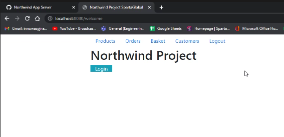
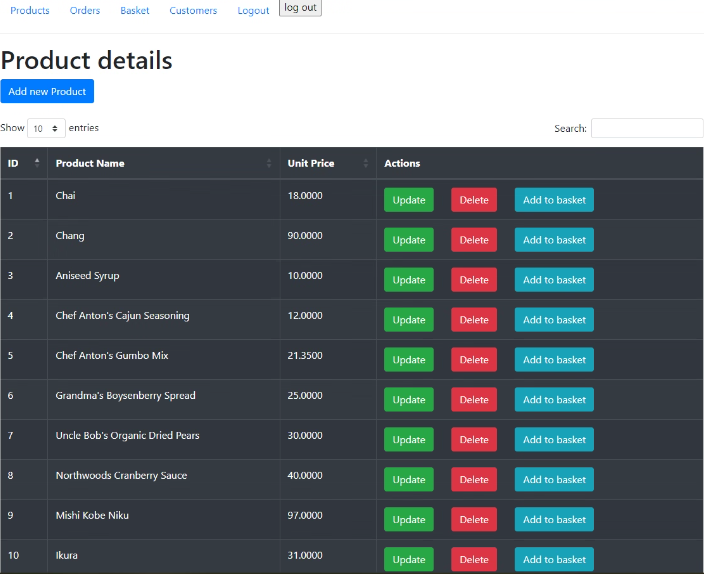

# Northwind Application Server

## Table of Contents

* [General Info](#general-information)
* [Technologies Used](#technologies-used)
* [Features](#features)
* [Screenshots](#screenshots)
* [Test](#Tests)
* [Setup](#setup)
* [Usage](#usage)
* [MySQL](#mysql-setup)
* [Performance upgrades](#Performance-upgrades)
* [Future Development](#Future-Development)
* [Contact](#contact)

## General Information

- Application created as part of sparta global training
- App allows users to obtain data from a database (MySql) and use it to purchase, view or delete products depending on the security clearance of the user.
- Webpage interface with dynamic buttons and tables.

## Technologies Used

- [SOLID](https://en.wikipedia.org/wiki/SOLID)
- [OOP](https://en.wikipedia.org/wiki/Object-oriented_programming)
- [MySQL](https://en.wikipedia.org/wiki/MySQL)
- [MAVEN](https://en.wikipedia.org/wiki/Apache_Maven)
- [GIT](https://en.wikipedia.org/wiki/Git)/[GITHUB](https://en.wikipedia.org/wiki/GitHub)
- [Collections](https://docs.oracle.com/en/java/javase/18/docs/api/java.base/java/util/Collections.html)
- [jUnit](https://en.wikipedia.org/wiki/JUnit)
- [Log4j](https://en.wikipedia.org/wiki/Log4j)
- [JDBC](https://en.wikipedia.org/wiki/Java_Database_Connectivity)
- [Scanner](https://docs.oracle.com/en/java/javase/18/docs/api/java.base/java/util/Scanner.html)
- [Hibernate](https://en.wikipedia.org/wiki/Hibernate_(framework))
- [SpringBoot](https://spring.io/projects/spring-boot)
- [Spring Security](https://spring.io/projects/spring-security)
- [JPA](https://spring.io/projects/spring-data-jpa)
- [Thymeleaf](https://www.thymeleaf.org/)
- [HTML](https://en.wikipedia.org/wiki/HTML)
- [Bootstrap](https://en.wikipedia.org/wiki/Bootstrap_(front-end_framework))
- [JQuery](https://jquery.com/)
- [Sessions](https://spring.io/projects/spring-session)
## Features
1. Users for each level of Security
2. Options to create, delete and buy products.
3. Retrieving individual record from database by ID for products.
## Usage
- By going to the webpage localhost://8080/welcome, you are taken to the first page:


- This page is where the user must log in to gain access to the information in the database. Depending on the user logging in, they will have more or less actions that they can use within the database. For example, Administrators will have full access to all things within the database. A normal user would only be able to view and add the products to the basket.




- After logging in, the user would see the product details panel, where they are shown a table of products available in the details. As shown from the perspective of the administrator, they have much more power over the database than others.

## Tests
### Basket Controller Tests:
```
@SpringBootTest(webEnvironment = WebEnvironment.RANDOM_PORT)
public class BasketPageTest {

    @Autowired
    private TestRestTemplate restTemplate;

    private static final int PORT = 8080;

    @Test
    public void basketPageHasAppropriateContents() throws Exception {
        assertThat(this.restTemplate.
                getForObject("http://localhost:" + 8080 + "/basket/show", String.class))
                .contains("Basket Details")
                .contains("Complete Order");
    }

    @Test
    public void basketPageDoesNotContainLorem() throws Exception {
        assertThat(this.restTemplate.
                getForObject("http://localhost:" + 8080 + "/basket/show", String.class))
                .doesNotContain("Lorem ipsum dolor sit amet");
    }

    @Test
    public void basketPageContainsTable() throws Exception {
        assertThat(this.restTemplate.
                getForObject("http://localhost:" + 8080 + "/basket/show", String.class))
                .contains("Search")
                .contains("Next")
                .contains("Previous");
    }
}
```
### Customer Page Tests:
```
@SpringBootTest(webEnvironment = WebEnvironment.RANDOM_PORT)
public class CustomerPageTest {


    @Autowired
    private TestRestTemplate restTemplate;

    private static final int PORT = 8080;

    @Test
    public void customerPageHasAppropriateContents() throws Exception {
        assertThat(this.restTemplate.
                getForObject("http://localhost:" + 8080 + "/customer/all", String.class))
                .contains("Customer Details");
    }

    @Test
    public void customerPageDoesntHaveLorem() throws Exception {
        assertThat(this.restTemplate.
                getForObject("http://localhost:" + 8080 + "/customer/all", String.class))
                .doesNotContain("Lorem ipsum dolor sit amet");
    }

    @Test
    public void allProductPageShouldHaveTable() throws Exception {
        assertThat(this.restTemplate.
                getForObject("http://localhost:" + 8080 + "/customer/all", String.class))
                .contains("Next")
                .contains("Previous")
                .contains("Show")
                .contains("Search");
    }
}
```
### Home Page Tests:
```
@SpringBootTest(webEnvironment = WebEnvironment.RANDOM_PORT)
public class HomePageTest {


    @Autowired
    private TestRestTemplate restTemplate;

    private static final int PORT = 8080;

    @Test
    public void homepageShouldReturnNorthwindMessage() throws Exception {
        assertThat(this.restTemplate.
                getForObject("http://localhost:" + 8080 + "/welcome", String.class))
                .contains("Northwind");
    }

    @Test
    public void homePageDoesntHaveLorem() throws Exception {
        assertThat(this.restTemplate.
                getForObject("http://localhost:" + 8080 + "/welcome", String.class))
                .doesNotContain("Lorem ipsum dolor sit amet");
    }

    @Test
    public void loginPageDoesNotHaveIrrelevantContent() throws Exception {
        assertThat(this.restTemplate.
                getForObject("http://localhost:" + 8080 + "/welcome", String.class))
                .doesNotContain("Products")
                .doesNotContain("Next")
                .doesNotContain("Previous");
    }
}
```
### Login Page Tests:
```
@SpringBootTest(webEnvironment = WebEnvironment.RANDOM_PORT)
public class LoginPageTest {


    @Autowired
    private TestRestTemplate restTemplate;

    private static final int PORT = 8080;

    @Test
    public void loginPageShouldHaveUsernamePasswordStrings() throws Exception {
        assertThat(this.restTemplate.
                getForObject("http://localhost:" + 8080 + "/login", String.class))
                .contains("Username")
                .contains("Password");
    }

    @Test
    public void loginPageDoesNotHaveLorem() throws Exception {
        assertThat(this.restTemplate.
                getForObject("http://localhost:" + 8080 + "/login", String.class))
                .doesNotContain("Lorem ipsum dolor sit amet");
    }

    @Test
    public void loginPageDoesNotHaveIrrelevantContent() throws Exception {
        assertThat(this.restTemplate.
                getForObject("http://localhost:" + 8080 + "/login", String.class))
                .doesNotContain("Products")
                .doesNotContain("Next")
                .doesNotContain("Previous");
    }
}
```
### Order Page Tests:
```
@SpringBootTest(webEnvironment = WebEnvironment.RANDOM_PORT)
public class OrderPageTest {


    @Autowired
    private TestRestTemplate restTemplate;

    private static final int PORT = 8080;

    @Test
    public void orderPageHasAppropriateContents() throws Exception {
        assertThat(this.restTemplate.
                getForObject("http://localhost:" + 8080 + "/orders/all", String.class))
                .contains("Order Details");
    }

    @Test
    public void orderPageDoesNotHaveLorem() throws Exception {
        assertThat(this.restTemplate.
                getForObject("http://localhost:" + 8080 + "/orders/all", String.class))
                .doesNotContain("Lorem ipsum dolor sit amet");
    }

    @Test
    public void allProductPageShouldHaveTable() throws Exception {
        assertThat(this.restTemplate.
                getForObject("http://localhost:" + 8080 + "/orders/all", String.class))
                .contains("Next")
                .contains("Previous")
                .contains("Show")
                .contains("Search");
    }
}
```
### Product Page Tests:
```
@SpringBootTest(webEnvironment = WebEnvironment.RANDOM_PORT)
public class ProductPageTest {


    @Autowired
    private TestRestTemplate restTemplate;

    private static final int PORT = 8080;

    @Test
    public void allProductPageShouldHaveProductDetails() throws Exception {
        assertThat(this.restTemplate.
                getForObject("http://localhost:" + 8080 + "/product/all", String.class))
                .contains("Product Details");
    }

    @Test
    public void allProductPageShouldHaveTable() throws Exception {
        assertThat(this.restTemplate.
                getForObject("http://localhost:" + 8080 + "/product/all", String.class))
                .contains("Next")
                .contains("Previous")
                .contains("Show")
                .contains("Search");
    }

    @Test
    public void allProductDoesNotHaveLorem() throws Exception {
        assertThat(this.restTemplate.
                getForObject("http://localhost:" + 8080 + "/product/all", String.class))
                .doesNotContain("Lorem ipsum dolor sit amet");
    }
}
```
## Setup
In order to use this application please clone repository onto your local machine
1. Use this [Link](https://github.com/ykolarov/Northwind-app-server)
2. Open your IntelliJ (or any other IDE of your preference )<br>
3. Create New > Project from version control
4. Paste repo ([link](https://github.com/ykolarov/Northwind-app-server)) & select where project will be saved. Click clone on bottom.
5. Once project is opened, load Maven build (pop up in right-hand corner)
## Future Plans
1. delete is not fully implemented (works only on newly added products / customers, not pre-existing)
2. save basket yet to be implemented (functionality is not yet there)
## Contact
Software created by :
- [Alfred Abraham](https://github.com/AlfredAbra)
- [Jamie Scofield](https://github.com/JamieScofield)
- [Yanaki Veselinov Kolarov](https://github.com/ykolarov)
- [David Carew](https://github.com/0V3RL0AD)
- [Piotr(Peter) Wiatr](https://github.com/wiater88)